# Mandelbrot 深度精化实验与 Zust BigFloat GPU 能力记录

本文记录一次基于 Zust、Metal GPU 与 BigFloat 的 Mandelbrot 深度放大实验。实验目标不是画常见的浅层 Mandelbrot，而是从高精度坐标出发，观察普通 `f32`、近似 `f64` 精度和更高位 BigFloat 在深 zoom 场景中的差异，并总结服务端渲染系统在精度、迭代次数、采样方式和客户端交互上的设计。

## 1. 实验出发点

本轮重点观察的坐标为：

```text
x = -0.744047327885618596691631635069778759229
y =  0.1098916491492589420042574690894010907545
step = 0.0000000000000000000009947598299507502772273195852327151970156
```

这个 `step` 约为 `9.9475982995e-22`，已经远小于普通 `f32` 和常规双精度浮点在该坐标附近能稳定表达的像素级间距。也就是说，在这个深度继续放大时，渲染问题不再只是“算 Mandelbrot”，而是：

- 坐标中心能否保存足够多有效位；
- 每个像素偏移能否真实叠加到中心坐标上；
- 迭代次数是否足够让慢逃逸点显现出边界层次；
- 显示时是否按当前 GPU 精度量化，而不是误导性展示过多十进制位。

## 2. 精度对比观察

### 2.1 f32 精度

在 `f32` 模式下，页面显示的坐标会被量化到 `f32` 能表达的有效精度。例如实验中出现：

```text
x    ~= -0.744047343
y    ~=  0.109891645
step ~=  0.000000000000000000000497379905
```

`f32` 在 `x ~= -0.744` 这个量级上只有大约 7 到 9 个十进制有效位。对于 `step ~= 1e-21` 的深 zoom，像素偏移已经远低于 `f32` 的坐标分辨率。结果是许多相邻像素落到几乎相同的复平面位置，图像会塌成大面积平滑色块或近似纯色区域。

结论：`f32` 只能用作浅层预览，不能用于这一组坐标的有效探索。

### 2.2 BigFloat<2>，近似 64-bit mantissa

`BigFloat<2>` 使用 2 个 `u32` limb，即 64-bit mantissa。它不是 IEEE `f64`，但有效位数量级接近双精度。实验中显示类似：

```text
x    ~= -0.744047327885618596781
y    ~=  0.10989164914925894195
step ~=  0.000000000000000000000497379914975375136967
```

它比 `f32` 明显好，能保留更多中心坐标信息，但对 `1e-21` 量级的像素步长来说仍然很紧张。画面仍可能缺少真正的深层结构，尤其在继续双击缩小 `step` 后会迅速接近精度边界。

结论：`BigFloat<2>` 可以看作双精度级别的过渡模式，用于对照和快速判断，但不是本实验的主力。

### 2.3 BigFloat<4>，约 128-bit mantissa

`BigFloat<4>` 使用 4 个 `u32` limb，即 128-bit mantissa。实验中进入该模式后，图像开始出现明显的细密结构：

```text
x    ~= -0.7440473278856185967907907034287632824382
y    ~=  0.1098916491492589419847261374429344422415
step ~=  0.0000000000000000000004973799149753751386136597926163575984281
```

在这一级，像素偏移终于能稳定参与计算，画面不再只是平滑色块，而是出现旋涡、放射状纹理和细碎边界。这说明前面“没细节”的主要原因不是 Mandelbrot 本身没结构，而是坐标精度和迭代次数不足。

结论：`BigFloat<4>` 是该坐标附近开始有效观察深层结构的最低实用档位。

## 3. 迭代次数的影响

一开始使用 `1000` 次迭代时，很多区域看起来像大块黑色或大块平滑颜色。后来确认，原因并不总是精度不足，而是迭代次数太少。

Mandelbrot 深 zoom 中有大量慢逃逸点。它们可能在 1000 次内还没有逃逸，于是被误判为内部点，显示为黑色。把迭代次数提高后，这些点会继续演化，边界的层次和细节才会出现。

当前系统支持四档：

```text
500    快速判断区域是否值得继续放大
1000   普通预览
5000   默认深度观察
10000  最终高质量输出
```

实验结论：

- `500` 适合快速扫图，判断大体构图和边界位置；
- `5000` 更适合深 zoom 交互；
- `10000` 适合保存成候选艺术图或 NFT 图；
- 单纯提高 BigFloat 精度不能替代提高迭代次数。

## 4. 采样方式的调整

早期渲染使用了超采样：

```text
2049 x 2049 sample buffer
每个最终像素取 3 x 3 共 9 个 sample 平均
```

这会让图像更平滑，但在寻找深层边界细节时也会把尖锐结构抹掉。后来改为：

```text
1024 x 1024 sample buffer
每个像素只采样一次
```

这样做的效果是：

- 边界更锐利；
- 小结构更容易被看见；
- GPU 输出 buffer 从 2049² 降到 1024²；
- 节省下来的像素计算量可用于更高迭代次数；
- 代价是抗锯齿减少，但这对“找细节”是可以接受的。

## 5. 当前服务端架构

系统采用服务器/客户端拆分：

- 服务端负责保存状态、处理坐标、调用 Zust GPU kernel、生成 PNG；
- 客户端只负责显示图像和发送用户操作；
- Android、H5、DApp、小程序都可以作为输出端；
- 客户端不计算 Mandelbrot 坐标，避免 `f32` 或 JS `Number` 破坏精度。

客户端以唯一 id 登录，不做身份验证。服务端用 Redis 按 client id 保存视图状态。

Redis 存储使用 msgpack，不使用 JSON 字符串保存 BigFloat 状态。视图状态包括：

```text
center_x
center_y
step
max_iter
precision
history
```

其中坐标和 step 在服务端统一保存为系统最大精度 `BigFloat<16>`。即使页面选择 `f32` 或 `BigFloat<2>` 预览，也不会把 Redis 中的高精度状态降级。

## 6. 交互规则

当前交互语义如下：

- 单击图像：服务端把中心移动到点击点；
- 双击图像：服务端把中心移动到点击点，并执行 `step >> 1`；
- 右键图像：服务端回退到该 client 的上一个 `pos/step`；
- 请求期间客户端锁定，不能继续点击，避免状态乱序；
- 页面刷新时只发送 client id，服务端从 Redis 恢复状态；
- 手动输入 `x/y/step` 并点击生成时，才覆盖服务端坐标。

特别注意：`step >> 1` 是在 Rust 服务端 BigFloat 表示上完成，不在客户端用字符串或 JS number 计算。

## 7. GPU 精度选择

页面目前支持以下 GPU 计算模式：

```text
f32
BigFloat<2>
BigFloat<4>
BigFloat<6>
BigFloat<8>
BigFloat<10>
BigFloat<12>
BigFloat<14>
BigFloat<16>
```

其中：

- `f32` 使用单独的 `mandelbrot_f32.zs` kernel；
- `BigFloat<N>` 使用泛型 `mandelbrot.zs` kernel；
- Rust 服务端通过 `gpu_struct_layout("mandelbrot::Params", [ConstInt(N)])` 按 N 打包参数；
- 运行时通过 `gpu::metal_run(options)` 编译并执行 Metal shader；
- 输出 buffer 是 `Vec<f32>`，保存的是每个像素的逃逸迭代值或平滑迭代值。

Zust kernel 形态如下：

```zust
pub struct Params<N> {
    x: bigfloat::BigFloat<N>,
    y: bigfloat::BigFloat<N>,
    step: bigfloat::BigFloat<N>,
    max_iter: u32,
}

pub fn main<N>(params: Params<N>, buf: Vec<f32>) {
    ...
}
```

这说明 Zust 的 GPU 后端可以把带 const generic 的 BigFloat 类型编译到 GPU kernel，并通过 Metal 执行。

## 8. 显示精度与存储精度分离

一个重要改进是：页面显示的十进制值按当前 GPU 精度量化，但服务端存储不降精度。

例如：

- 选择 `f32` 时，显示约 9 个有效十进制数字；
- 选择 `BigFloat<2>` 时，显示约 64-bit mantissa 对应的有效位；
- 选择 `BigFloat<4>` 时，显示约 128-bit mantissa 对应的有效位；
- 选择 `BigFloat<16>` 时，显示系统保存的高精度状态。

这样做可以避免一个误导：如果用 `f32` 计算，却在 UI 上显示很多十进制位，用户会以为这些位真的参与了 GPU 运算。现在 UI 显示会诚实反映当前 GPU kernel 的有效精度。

## 9. BigFloat 实现能力

`zusts/bigfloat.zs` 中的 BigFloat 使用：

```zust
pub struct BigFloat<N> {
    sign: bool,
    exp: i32,
    data: [u32; N],
}
```

含义为：

- `sign` 表示符号；
- `exp` 表示以 2^32 为基底的指数；
- `data` 是 N 个 32-bit limb；
- 有效 mantissa 位数约为 `32 * N`。

所以常见配置可粗略理解为：

```text
BigFloat<2>   64-bit mantissa
BigFloat<4>   128-bit mantissa
BigFloat<8>   256-bit mantissa
BigFloat<16>  512-bit mantissa
```

当前 GPU BigFloat 支持：

- `zero`
- `from_u32`
- `from_f32`
- `add`
- `sub`
- `mul`
- `cmp / lt / le / gt / ge`
- `to_f32`

在 Mandelbrot kernel 中已经实际使用：

- BigFloat 坐标构造；
- BigFloat 乘法计算 `zx²`、`zy²`；
- BigFloat 加减计算迭代；
- BigFloat 比较判断逃逸半径；
- 最后把逃逸半径转为 `f32` 做颜色平滑。

## 10. BigFloat 规范化问题与修复

实验中曾遇到 `BigFloat<8>` 全黑的问题。根因不是 GPU 不能算 `<8>`，而是服务端把旧 Redis 中的 `<4>` 状态扩展到 `<8>` 时，只增加了 limb 数，没有把 mantissa 左移到高 limb，也没有同步调整 `exp`。

修复方式：

- `from_signed_mantissa` 会 canonicalize mantissa；
- mantissa 太大时右移并增加 `exp`；
- mantissa 太小时左移并减少 `exp`；
- 读取旧 Redis 记录后会 normalize 到系统保存精度；
- 渲染到某个 `BigFloat<N>` 时再临时转换到 N limb。

这个修复使得：

- 旧状态可以安全迁移到更高精度；
- 切换 GPU 精度不会污染服务端保存状态；
- `BigFloat<8>`、`<10>`、`<16>` 都能稳定运行。

## 11. 对 NFT 生成的启发

如果目标是生成“别人没见过”的 Mandelbrot NFT 图，浅层 `f32` 图没有太大意义，因为它们太常见。更有价值的路径是：

1. 从人工发现的高精度坐标出发；
2. 用 `500` 次迭代快速判断构图；
3. 如果结构有潜力，提升到 `5000` 或 `10000`；
4. 如果图像开始塌成色块或像素移动失效，提升 `BigFloat<N>`；
5. 最终保存图像时记录：
   - center x
   - center y
   - step
   - BigFloat 精度
   - 迭代次数
   - 生成耗时
   - 图像描述

本轮实验表明：真正决定深层图是否有价值的不是单一参数，而是坐标精度、迭代次数、采样方式和策展判断共同作用。

## 12. 当前结论

- `f32` 在本轮坐标下已经失效，只能做对照；
- `BigFloat<2>` 约等于双精度级别，仍不足以支撑更深放大；
- `BigFloat<4>` 开始出现肉眼可见的深层结构；
- 更高的 `BigFloat<N>` 为继续放大保留了空间；
- `1000` 次迭代会误判大量慢逃逸点；
- `5000` 和 `10000` 更适合深 zoom 输出；
- 单点采样比 3x3 平均更适合寻找细节；
- Zust 已经能够把泛型 BigFloat Mandelbrot kernel 编译并运行在 Metal GPU 上；
- 服务端必须保存高精度状态，客户端只能作为输出端。

这次实验的核心收获是：Mandelbrot 的深层探索不只是“提高浮点位数”，而是要让坐标表示、GPU kernel、迭代深度、状态存储和交互策略全部保持一致。Zust BigFloat 的价值正在这里体现出来。

## 13. NFT 生成流程修正

预设坐标批量生成图片没有太大意义。更合理的 NFT 生成流程应该从当前浏览器里的图像出发，让系统像人一样沿着已经发现的结构继续探索：

1. 从当前浏览器图像开始，不使用外部预设坐标。
2. 对当前 PNG 做图像分析，寻找边界复杂、细节密度高的位置。
3. 在这些高复杂度候选点中自动点击并放大。
4. 先用 `500` 次迭代快速判断该区域是否值得继续。
5. 如果局部结构有潜力，再提升到 `5000` 或 `10000` 次迭代。
6. 如果低精度图像塌成色块、移动失效或边界失真，就提升 `BigFloat<N>`。
7. 每张 NFT 必须来自这条探索链，记录父图、点击点、坐标、step、迭代次数、BigFloat 精度和最终图像。

这个流程的核心不是“随机找漂亮坐标”，而是把 Mandelbrot 深 zoom 的探索过程本身保存下来。这样生成的 NFT 才能说明：这张图是从某个高精度位置继续挖出来的，而不是浅层常见区域的重复截图。

## 14. NFT 资产附录：中间图与坐标

下面这些图是本轮实验中已经生成并保存到文档资产目录的候选资产。它们包括失败对照图和有效高精度图。失败图不应删除，因为它们解释了为什么必须使用 BigFloat 和更高迭代次数。

### 14.1 f32 精度失效对照


```text
asset: docs/assets/mandelbrot-f32-collapse.png
role: f32-failure-control
precision: f32
x ~= -0.744047343
y ~=  0.109891645
step ~= 0.000000000000000000000497379905
```

说明：这是低精度对照图。该 zoom 层级下 `f32` 已经不能表达像素级坐标变化，图像塌成近似单色区域。它适合放在 NFT 系列说明里，作为“为什么普通浮点不够”的证据。

### 14.2 BigFloat<2> / 近似 f64 级别失效对照


```text
asset: docs/assets/mandelbrot-bf2-collapse.png
role: bf2-failure-control
precision: BigFloat<2>
x ~= -0.744047327885618596781
y ~=  0.10989164914925894195
step ~= 0.000000000000000000000497379914975375136967
```

说明：`BigFloat<2>` 已经接近双精度级别，但在这组坐标附近仍然无法显示真正的深层结构。它说明“f64 级别”在该 zoom 层级下也不够。

### 14.3 低迭代边界图

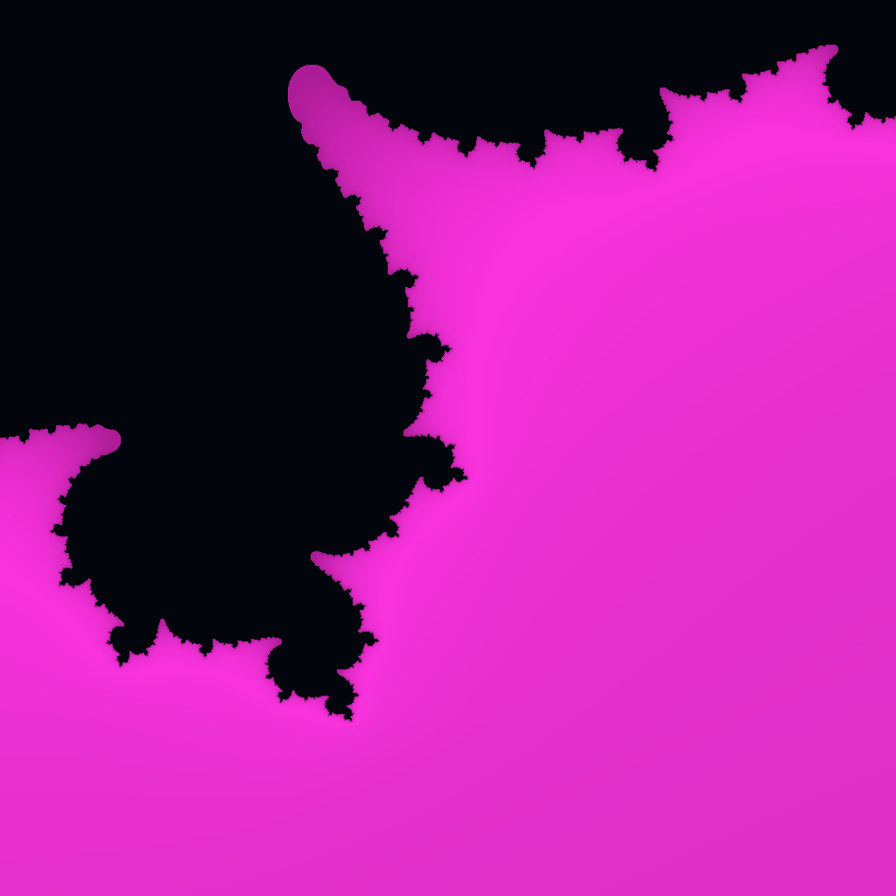

```text
asset: docs/assets/mandelbrot-low-iteration-boundary.png
role: iteration-control
precision: BigFloat<10>
x ~= -0.7440473278856185824217402521359151009700970461847582644106194690265486725663716814159292035398227
y ~=  0.10989164914925894216050812226113427884280796670678830589054867256637168141592920353982300884955734
step ~= 0.000000000000000000063664629116848017742548453454893772618374999999999999999999999999999999999991777040465
```

说明：这张图有边界，但细节仍然偏少。它用于说明：即使 BigFloat 精度足够，迭代次数不足也会让慢逃逸区域显得贫乏。

### 14.4 BigFloat<4> 细节显现图

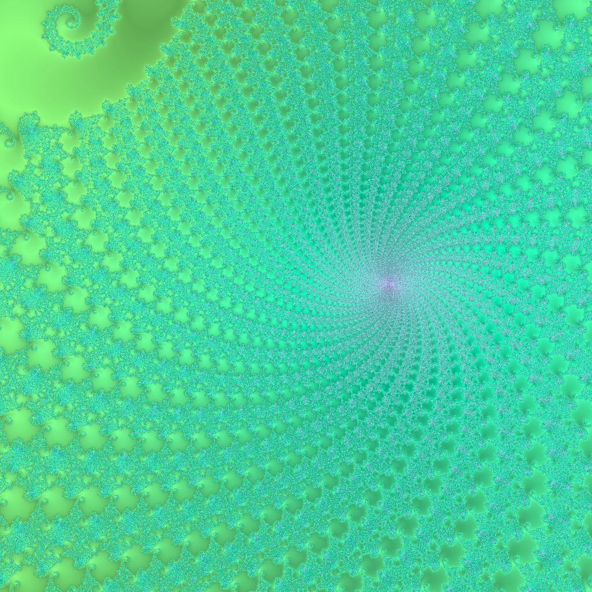

```text
asset: docs/assets/mandelbrot-bf4-detail.png
role: candidate-nft
precision: BigFloat<4>
x ~= -0.7440473278856185967907907034287632824382
y ~=  0.1098916491492589419847261374429344422415
step ~= 0.0000000000000000000004973799149753751386136597926163575984281
```

说明：这是当前最有代表性的高精度图之一。`BigFloat<4>` 开始显示出放射状纹理、旋涡和细碎边界，可以作为 NFT 系列中的“精度突破”图。

### 14.5 高精度旋涡细节场

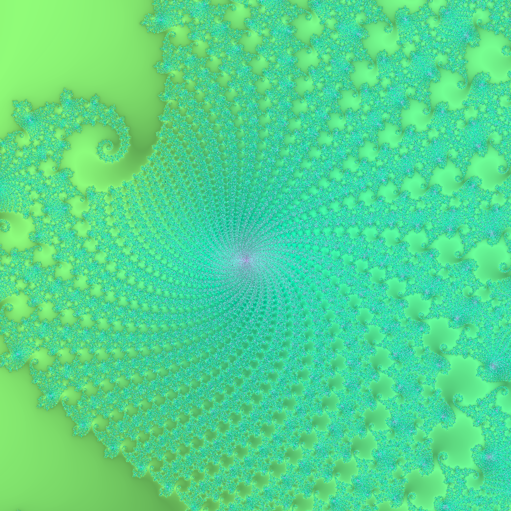

```text
asset: docs/assets/mandelbrot-bf4-spiral-field.png
role: candidate-nft
precision: BigFloat<4> or higher
coordinates = same as section 1 starting point
note = kept here as the high-precision spiral-field asset derived from that point
```

说明：这是从用户给定高精度坐标出发得到的细节场。它的价值在于不是普通浅层 Mandelbrot，而是由 BigFloat 保存的深层坐标继续展开出来的结构。

## 15. 后续 NFT 自动探索记录格式

后续每一张正式 NFT 建议记录为：

```text
title:
image:
parent_image:
click_x:
click_y:
center_x:
center_y:
step:
precision:
max_iter:
render_time_ms:
description:
why_selected:
```

其中 `why_selected` 应该来自图像分析，例如：

- 边界黑/彩转换密度高；
- 局部颜色熵高；
- 存在旋涡或重复自相似结构；
- 低迭代预览有潜力，高迭代后细节显著增加；
- 低精度失效，高精度恢复结构。

这样每张 NFT 不只是图片，而是一条可追溯的 Mandelbrot 深度探索记录。

## 16. 逐张执行的 NFT 探索结果
以下图像不是外部预设坐标生成，而是从当前高精度浏览器视图出发，逐轮执行：500 次预览、图像复杂度分析、自动选点、双击放大、必要时提升 BigFloat 精度、10000 次迭代保存。每生成一张就写入本节，再继续下一张。

注意：当精度不足时，页面显示的 `x/y/step` 已经是当前低精度能表达的量化值，缺少原始真实高精度坐标。因此失效对照图只能记录量化后的坐标；高精度探索链则继续由服务端 `BigFloat<16>` 状态保存。

### 16.1 Deep Zoom Trace 01
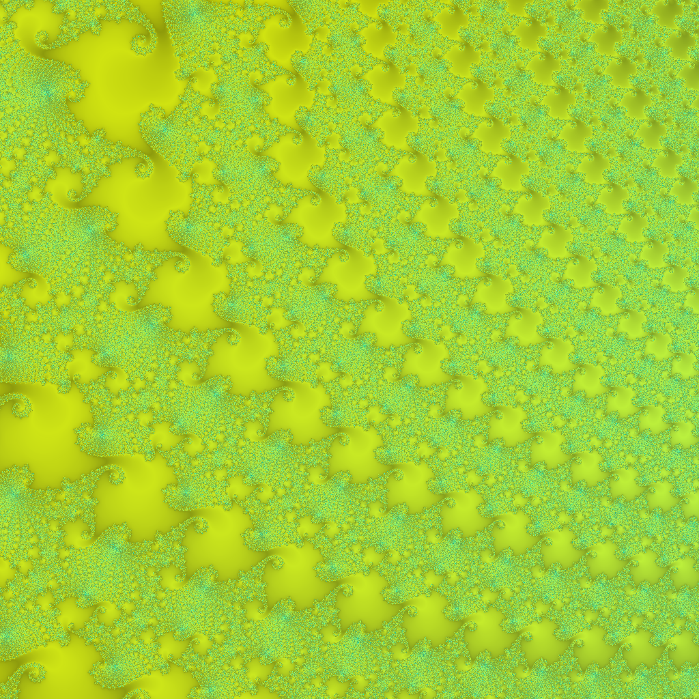
从当前 bf4 深层视图出发，500 次预览已经全内失效，因此改用 5000 次确认边界后保存这一片细丝潮汐场。 点击像素 (168, 472)，preview_iter=5000，score=1509.9，step=0.0000000000000000000002486899574876875693068298963081787990547。

```text
asset = docs/assets/nft-explore-01-bf4-10000.png
parent_preview = docs/assets/nft-explore-101-bf4-5000.png
click = (168, 472)
center_x = -0.7440473278856185969618893941802923301194
center_y = 0.1098916491492589420046213340419494477849
step = 0.0000000000000000000002486899574876875693068298963081787990547
precision = bf4
max_iter = 10000
preview_iter = 5000
preview_score = 1509.85
render_time_ms = 6004.7
```

### 16.2 Deep Zoom Trace 02
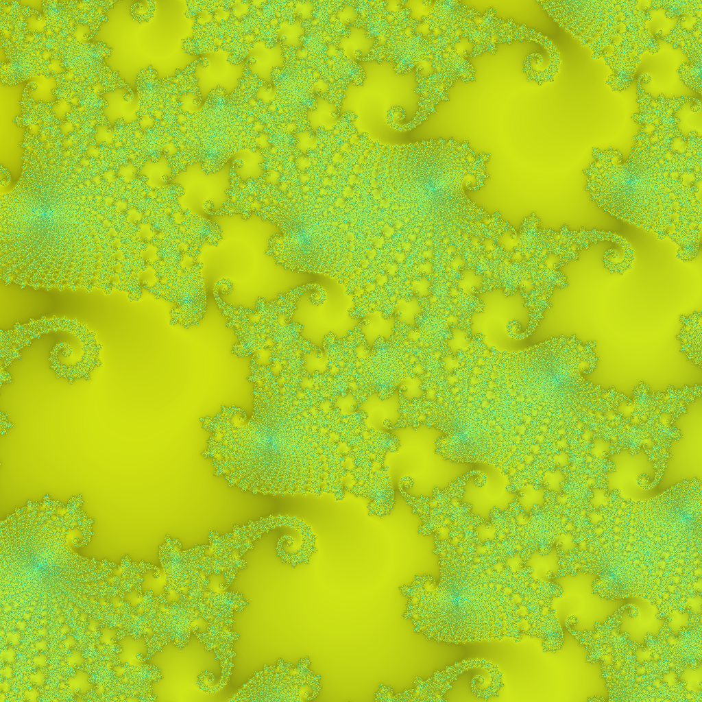
第二步沿高复杂度边界向左侧推进，画面里出现更宽的绿色缓逃逸区域和多组小旋臂。 点击像素 (72, 456)，preview_iter=5000，score=1386.6，step=0.0000000000000000000001243449787438437846534149481540893994477。

```text
asset = docs/assets/nft-explore-02-bf4-10000.png
parent_preview = docs/assets/nft-explore-102-bf4-5000.png
click = (72, 456)
center_x = -0.7440473278856185970713129754748748606138
center_y = 0.109891649149258942018547971661259951667
step = 0.0000000000000000000001243449787438437846534149481540893994477
precision = bf4
max_iter = 10000
preview_iter = 5000
preview_score = 1386.56
render_time_ms = 5291.9
```

### 16.3 Deep Zoom Trace 03
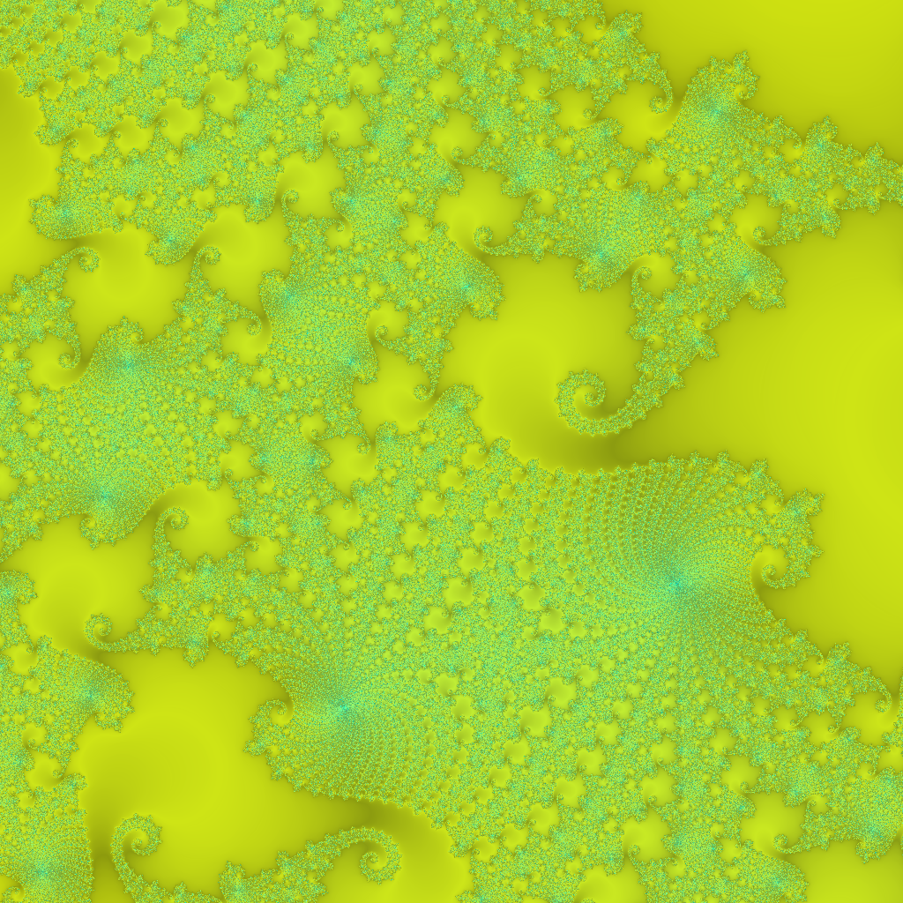
这一跳选择上方密集边界，局部开始形成扇形放射纹理，说明继续缩小 step 仍有结构。 点击像素 (504, 200)，preview_iter=5000，score=1562.8，step=0.00000000000000000000006217248937192189232670747407704469964421。

```text
asset = docs/assets/nft-explore-03-bf4-10000.png
parent_preview = docs/assets/nft-explore-103-bf4-5000.png
click = (504, 200)
center_x = -0.7440473278856185970723077353048256108907
center_y = 0.1098916491492589420573436050293392124769
step = 0.00000000000000000000006217248937192189232670747407704469964421
precision = bf4
max_iter = 10000
preview_iter = 5000
preview_score = 1562.81
render_time_ms = 5496.3
```

### 16.4 Deep Zoom Trace 04
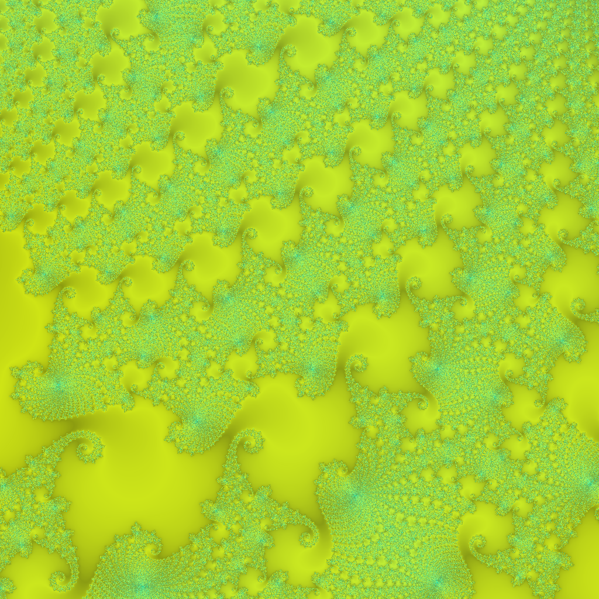
第四张进入更均匀的细碎海岸线区域，细节密度继续上升，适合作为系列中的连续探索证据。 点击像素 (280, 168)，preview_iter=5000，score=1628.1，step=0.0000000000000000000000310862446859609461633537370385223498221。

```text
asset = docs/assets/nft-explore-04-bf4-10000.png
parent_preview = docs/assets/nft-explore-104-bf4-5000.png
click = (280, 168)
center_x = -0.7440473278856185970867317528391114899127
center_y = 0.109891649149258942078730941373280343437
step = 0.0000000000000000000000310862446859609461633537370385223498221
precision = bf4
max_iter = 10000
preview_iter = 5000
preview_score = 1628.12
render_time_ms = 5757.2
```

### 16.5 Deep Zoom Trace 05
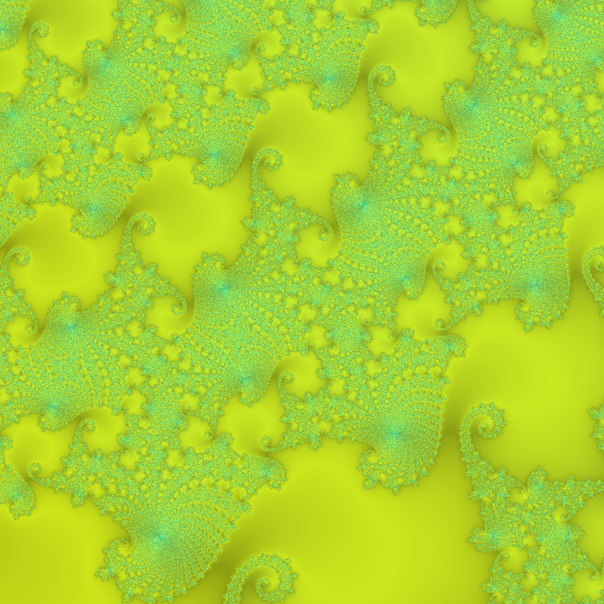
这一张保留了大片平滑底色和密集边界之间的对比，中心附近的亮点开始形成重复节奏。 点击像素 (456, 520)，preview_iter=5000，score=1634.9，step=0.00000000000000000000001554312234298047308167686851926117491105。

```text
asset = docs/assets/nft-explore-05-bf4-10000.png
parent_preview = docs/assets/nft-explore-105-bf4-5000.png
click = (456, 520)
center_x = -0.744047327885618597088472582541525302898
center_y = 0.1098916491492589420784822514157926558685
step = 0.00000000000000000000001554312234298047308167686851926117491105
precision = bf4
max_iter = 10000
preview_iter = 5000
preview_score = 1634.93
render_time_ms = 5620.2
```

### 16.6 Deep Zoom Trace 06
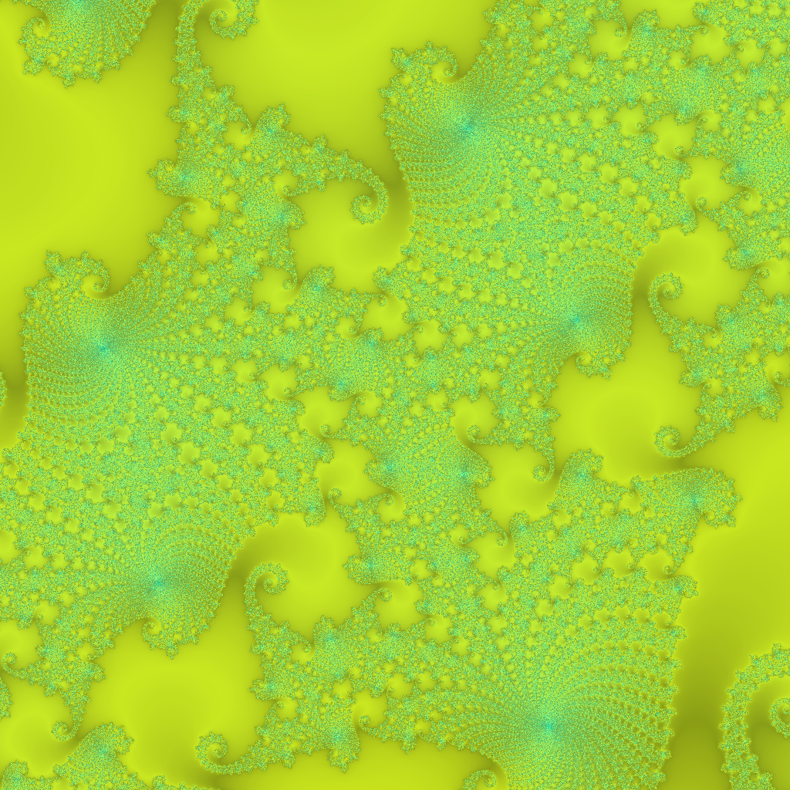
第六步复杂度短暂回落，但多个旋臂和放射核仍然清楚，证明该路径没有塌成无效色块。 点击像素 (568, 520)，preview_iter=5000，score=1393.0，step=0.000000000000000000000007771561171490236540838434259630587375872。

```text
asset = docs/assets/nft-explore-06-bf4-10000.png
parent_preview = docs/assets/nft-explore-106-bf4-5000.png
click = (568, 520)
center_x = -0.7440473278856185970876021676903183964039
center_y = 0.1098916491492589420783579064370488120828
step = 0.000000000000000000000007771561171490236540838434259630587375872
precision = bf4
max_iter = 10000
preview_iter = 5000
preview_score = 1393.05
render_time_ms = 5705.9
```

### 16.7 Deep Zoom Trace 07
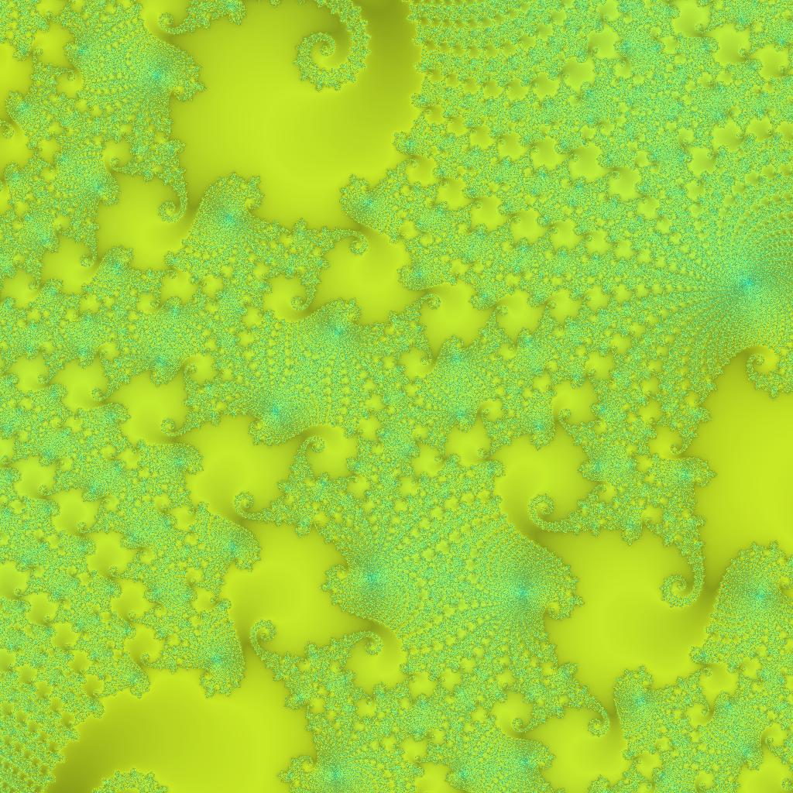
第七张重新进入高密度边界簇，预览分数明显跃升，画面出现更紧的螺旋和颗粒状分叉。 点击像素 (520, 488)，preview_iter=5000，score=2032.8，step=0.000000000000000000000003885780585745118270419217129815293687936。

```text
asset = docs/assets/nft-explore-07-bf4-10000.png
parent_preview = docs/assets/nft-explore-107-bf4-5000.png
click = (520, 488)
center_x = -0.7440473278856185970875399952009464745125
center_y = 0.1098916491492589420785444239051645777599
step = 0.000000000000000000000003885780585745118270419217129815293687936
precision = bf4
max_iter = 10000
preview_iter = 5000
preview_score = 2032.76
render_time_ms = 6082.2
```

### 16.8 Deep Zoom Trace 08
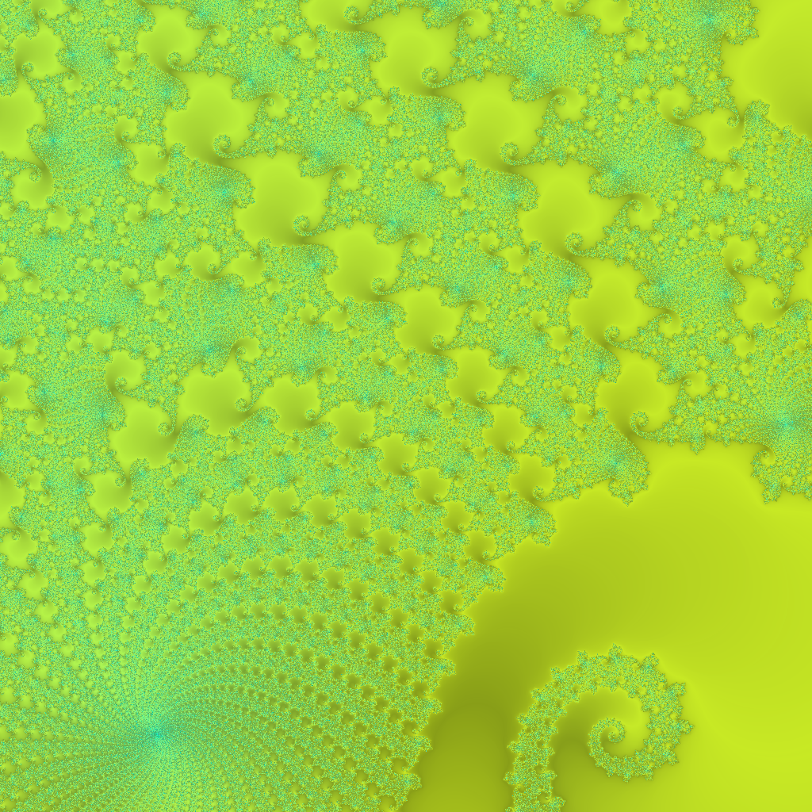
第八张沿下方边界继续放大，大旋臂切入画面，左下角出现更强的放射中心。 点击像素 (40, 840)，preview_iter=5000，score=2186.8，step=0.000000000000000000000001942890292872559135209608564907646843968。

```text
asset = docs/assets/nft-explore-08-bf4-10000.png
parent_preview = docs/assets/nft-explore-108-bf4-5000.png
click = (40, 840)
center_x = -0.7440473278856185970893740836374181703349
center_y = 0.1098916491492589420772698878730401789689
step = 0.000000000000000000000001942890292872559135209608564907646843968
precision = bf4
max_iter = 10000
preview_iter = 5000
preview_score = 2186.84
render_time_ms = 6038.0
```

### 16.9 Deep Zoom Trace 09
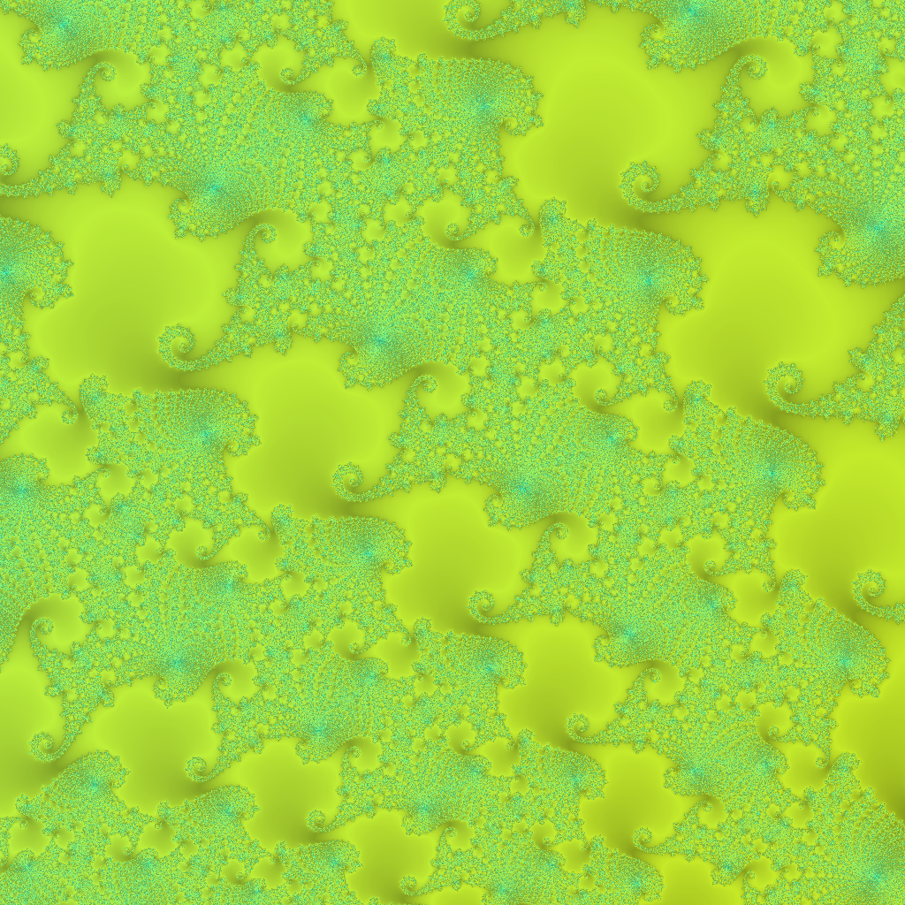
第九张是本轮复杂度最高的位置，多个边界簇同时展开，作为 NFT 候选优先级最高。 点击像素 (536, 344)，preview_iter=5000，score=2228.5，step=0.000000000000000000000000971445146436279567604804282453823421984。

```text
asset = docs/assets/nft-explore-09-bf4-10000.png
parent_preview = docs/assets/nft-explore-109-bf4-5000.png
click = (536, 344)
center_x = -0.7440473278856185970893274542703892289163
center_y = 0.1098916491492589420775962934422427689016
step = 0.000000000000000000000000971445146436279567604804282453823421984
precision = bf4
max_iter = 10000
preview_iter = 5000
preview_score = 2228.51
render_time_ms = 5932.9
```

### 16.10 Deep Zoom Trace 10
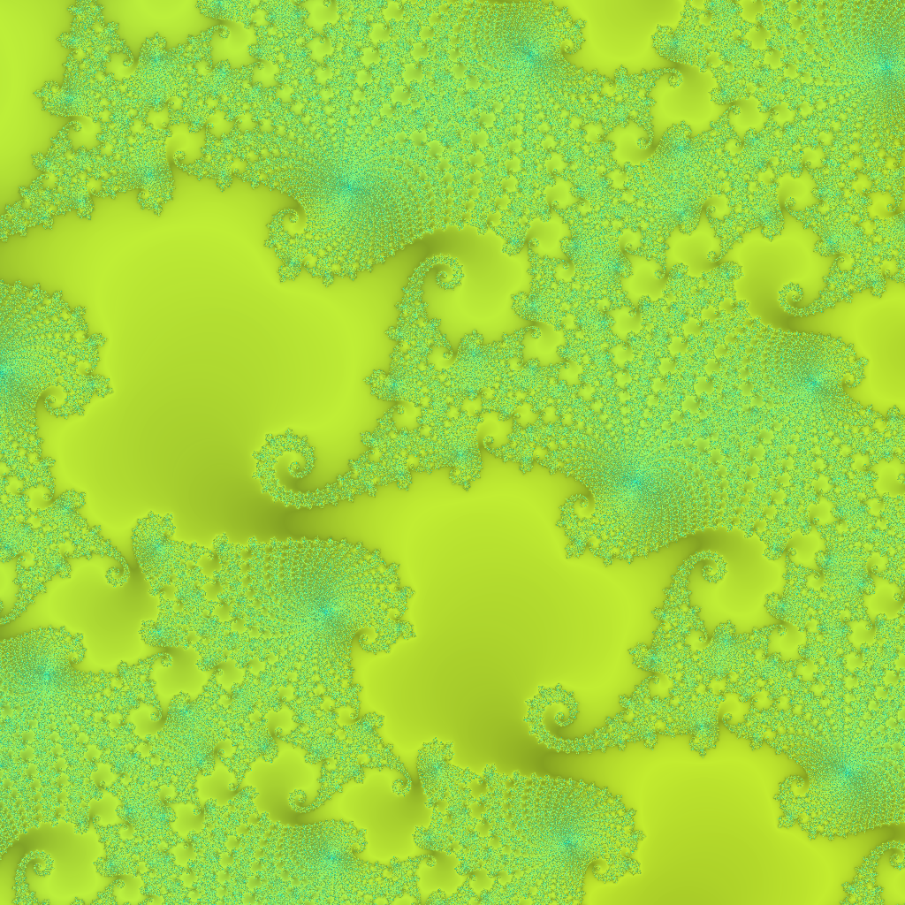
最后一张继续沿第九张的高密度区域收束，保留了大块缓逃逸底色和周围细丝的张力。 点击像素 (488, 536)，preview_iter=5000，score=2080.3，step=0.000000000000000000000000485722573218139783802402141226911710992。

```text
asset = docs/assets/nft-explore-10-bf4-10000.png
parent_preview = docs/assets/nft-explore-110-bf4-5000.png
click = (488, 536)
center_x = -0.7440473278856185970893507689539036996256
center_y = 0.1098916491492589420775729787587282981923
step = 0.000000000000000000000000485722573218139783802402141226911710992
precision = bf4
max_iter = 10000
preview_iter = 5000
preview_score = 2080.33
render_time_ms = 5917.2
```
